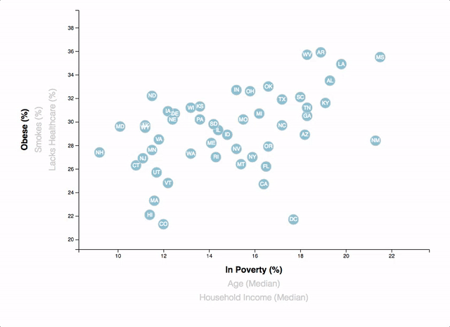

# D3 Homework - Data Journalism and D3

## Given Background:

'Welcome to the newsroom! You've just accepted a data visualization position for a major metro paper. You're tasked with analyzing the current trends shaping people's lives, as well as creating charts, graphs, and interactive elements to help readers understand your findings.

The editor wants to run a series of feature stories about the health risks facing particular demographics. She's counting on you to sniff out the first story idea by sifting through information from the U.S. Census Bureau and the Behavioral Risk Factor Surveillance System.

The data set included with the assignment is based on 2014 ACS 1-year estimates from the [US Census Bureau](https://data.census.gov/cedsci/), but you are free to investigate a different data set. The current data set includes data on rates of income, obesity, poverty, etc. by state. MOE stands for "margin of error."'

## Assignment Task:

### Core Assignment: D3 Dabbler

A scatter plot was created between two of the data variables such as `Healthcare vs. Poverty` or `Smokers vs. Age`.

Using the D3 techniques taught in the KU Data Visualization course, a scatter plot was created that represents each state with circle elements. This graphic was coded in the `app.js` file of the /CodeFiles/assests directory of this repository and the data was pulled in the directly from `data.csv` by using the `d3.csv` function.
The scatter plot ultimately appears like the image at the top of this section!

### Bonus: Impress the Boss (Optional Assignment)

Q: Why make a static graphic when D3 lets you interact with your data?

#### 1. More Data, More Dynamics
 In the bonus section of this assignment, more demographics were included. Thus, more risk factors!
Additional labels were placed in the scatter plot and click events were given so that the users can decide which data to display. 
The transitions for the circles' locations & the range of the axes were animated!

#### 2. Incorporate d3-tip
While the ticks on the axes allow us to infer approximate values for each circle, it's impossible to determine the true value without adding another layer of data.
Tooltips were entered to address this issue!
Developers can implement these in their D3 graphics to reveal a specific element's data when the user hovers their cursor over the element. Tooltips were added to the circles, displaying each tooltip with the data that the user has selected. 

## Deliverables: 
The final submissions for this assignment can be found in the directory CodeFiles within this respository.
